---
## Author
author:
  name: Слаюоспицкий Платон Сергеевич
  degrees: Бакалавр
  orcid: 0000-0002-0877-7063
  email: 1032253559@pfur.ru
  affiliation:
    - name: Российский университет дружбы народов
      country: Российская Федерация
      postal-code: 117198
      city: Москва
      address: ул. Миклухо-Маклая, д. 6

## Title
title: "Отчет по лабораторной номер 1"
subtitle: "Чистовой вариант"
license: "CC BY"
---

# Цель работы
Целью данной работы является приобретение практических навыков установки операционной системы на виртуальную машину, настройки минимально необходимых для дальнейшей работы сервисов.
# Задание
- Установка Linux в VirtualBox
- Установка всего необходимого ПО
- А также частичная настройка ОС для дальнейшей работы

# Теоретическое введение

Oracle VirtualBox — программный гипервизор для создания и управления виртуальными машинами. Позволяет запускать операционные системы (Windows, Linux, macOS и другие) внутри основной системы без необходимости перезагрузки или настройки двойной загрузки

# Выполнение лабораторной работы
Выполнена подготовка виртуального диска и запуск образа ОС.(Рис. 1 Рис. 2 Рис. 3 Рис. 4)

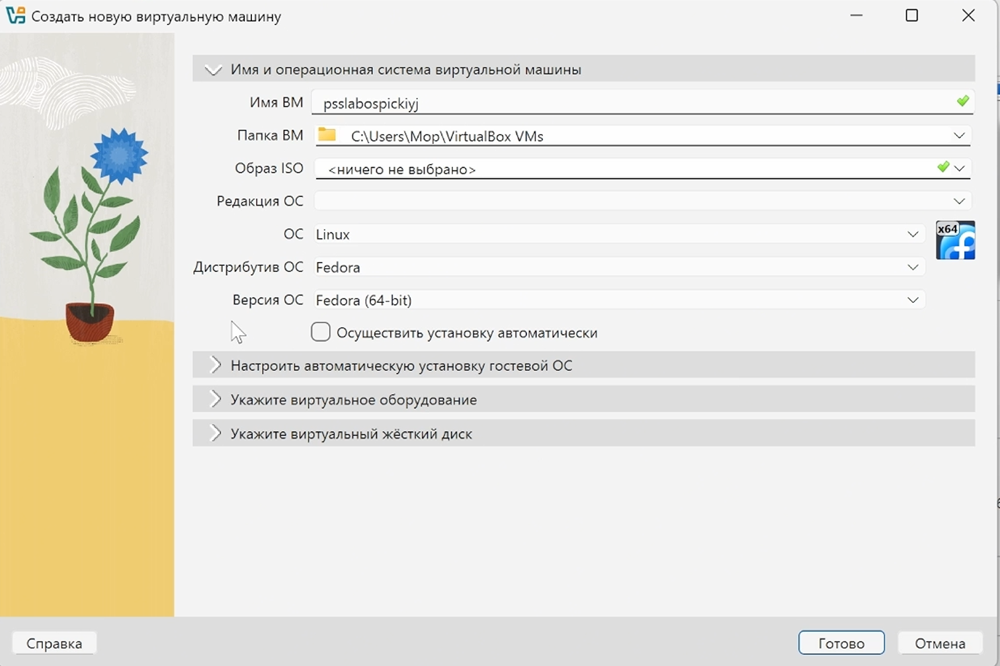{#fig:0 width=70%}

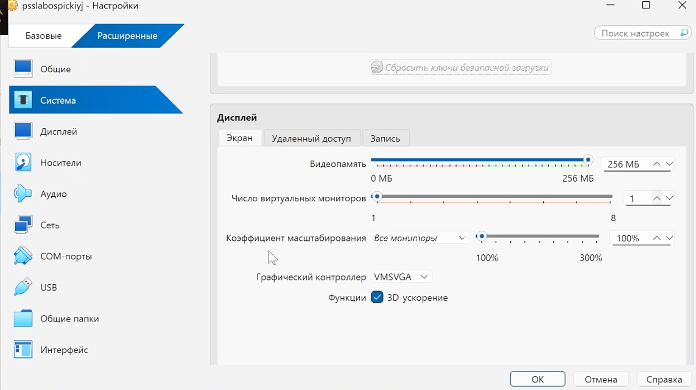{#fig:0 width=70%}

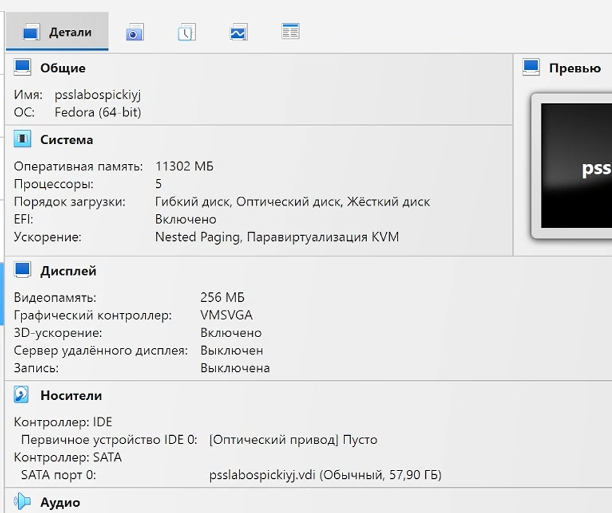{#fig:0 width=70%}

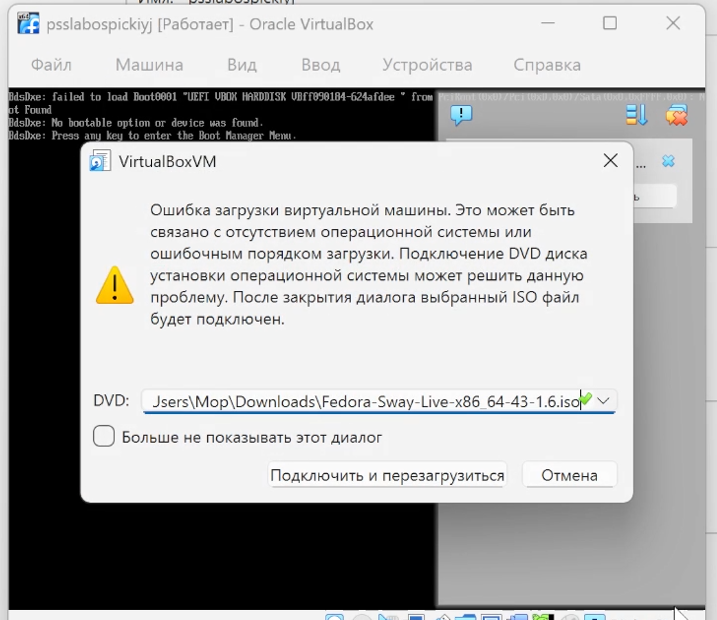{#fig:0 width=70%}

Произведена установка пакетов и их обновление через скрипт для dnf. 
(Рис. 5 Рис. 6 Рис. 7 Рис. 8 Рис. 9 Рис. 10 Рис. 11 Рис. 12)

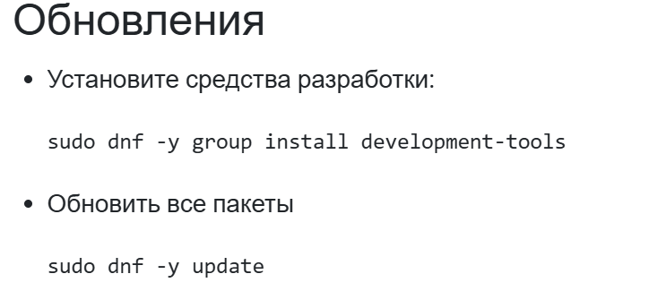{#fig:0 width=70%}

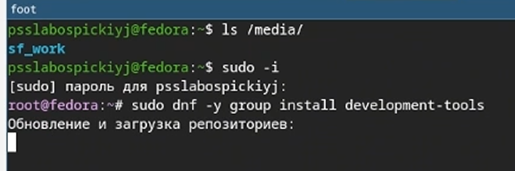{#fig:0 width=70%}

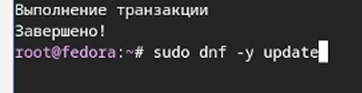{#fig:0 width=70%}

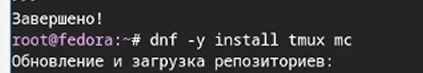{#fig:0 width=70%}

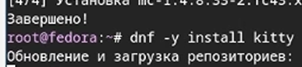{#fig:0 width=70%}

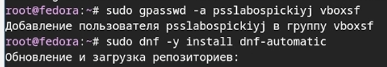{#fig:0 width=70%}

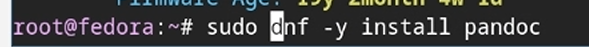{#fig:0 width=70%}

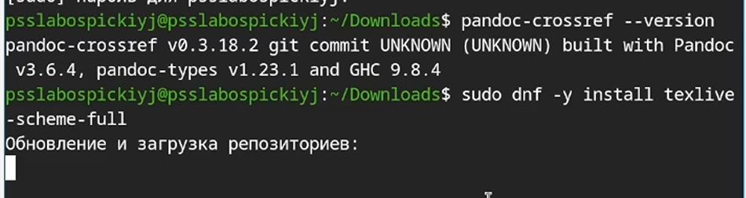{#fig:0 width=70%}

Скачал и настроил Pandoc (Рис. 13 Рис. 14)

{#fig:0 width=70%}

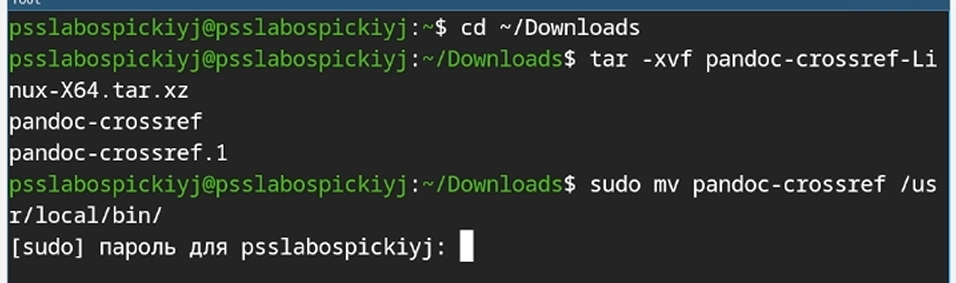{#fig:0 width=70%}

Отключена защита SELinux. (Рис. 15 Рис. 16)

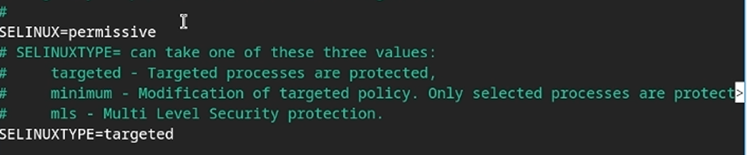{#fig:0 width=70%}

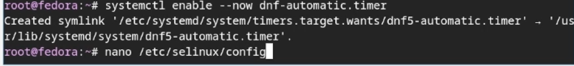{#fig:0 width=70%}

Настроена клавиатура (xkb): добавлена русская раскладка с переключением на правый Ctrl. (Рис. 17 Рис. 18 Рис. 19 Рис. 20 Рис. 21 Рис. 22 Рис. 23 Рис. 24)
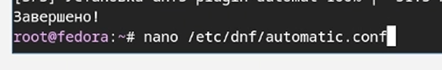{#fig:0 width=70%}

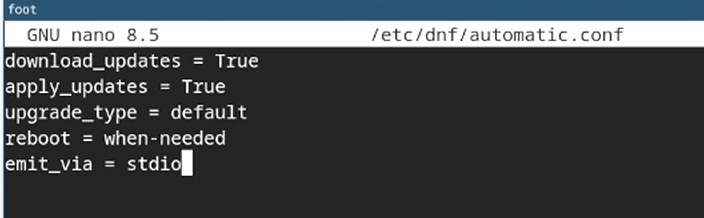{#fig:0 width=70%}

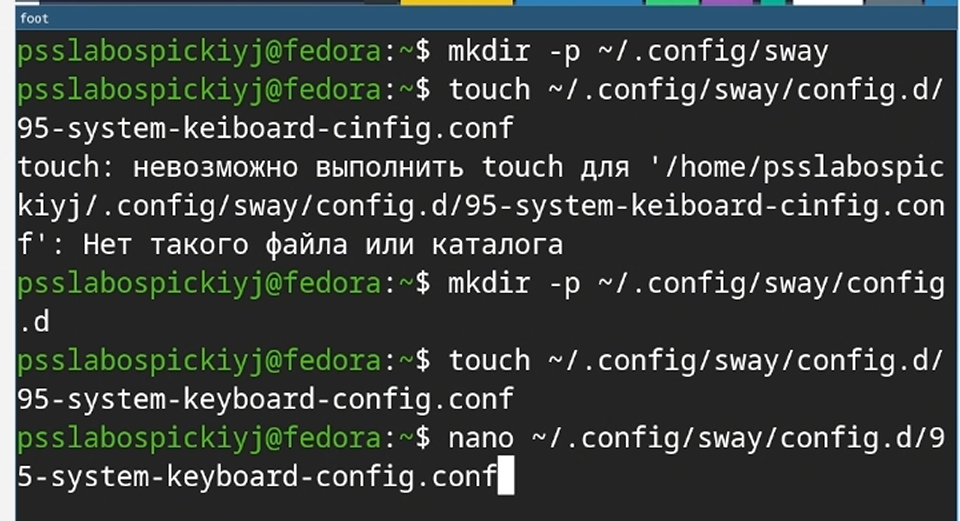{#fig:0 width=70%}

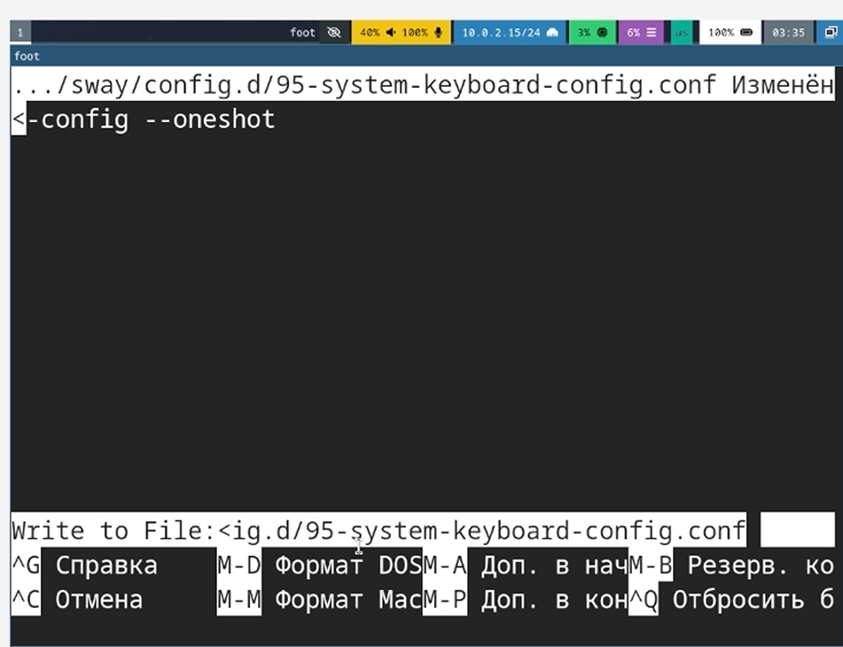{#fig:0 width=70%}

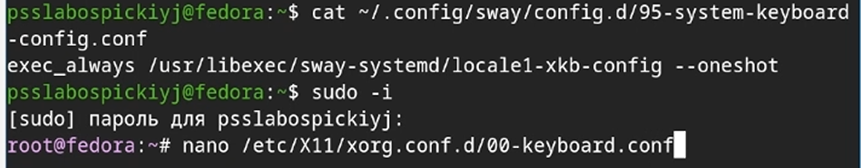{#fig:0 width=70%}

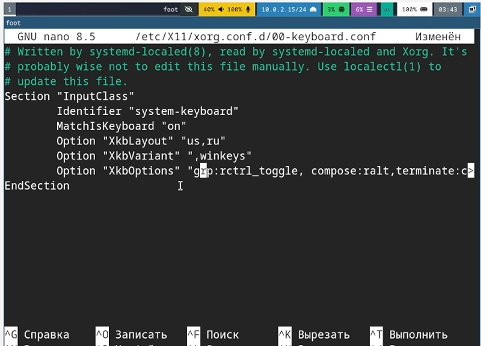{#fig:0 width=70%}

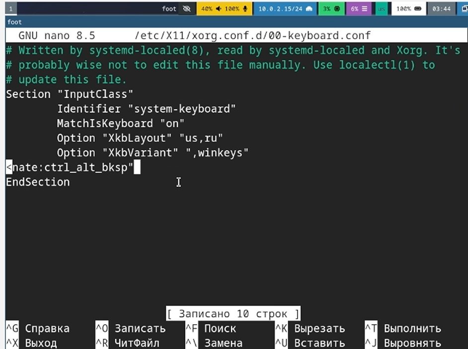{#fig:0 width=70%}

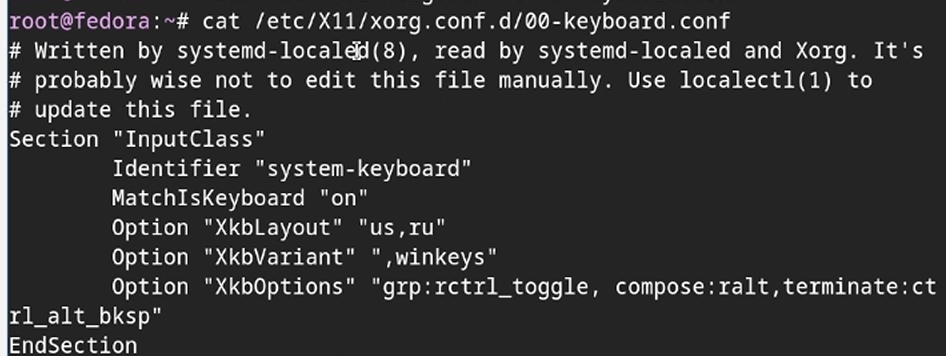{#fig:0 width=70%}

Проверен hostname. (рис. 25 Рис. 26)

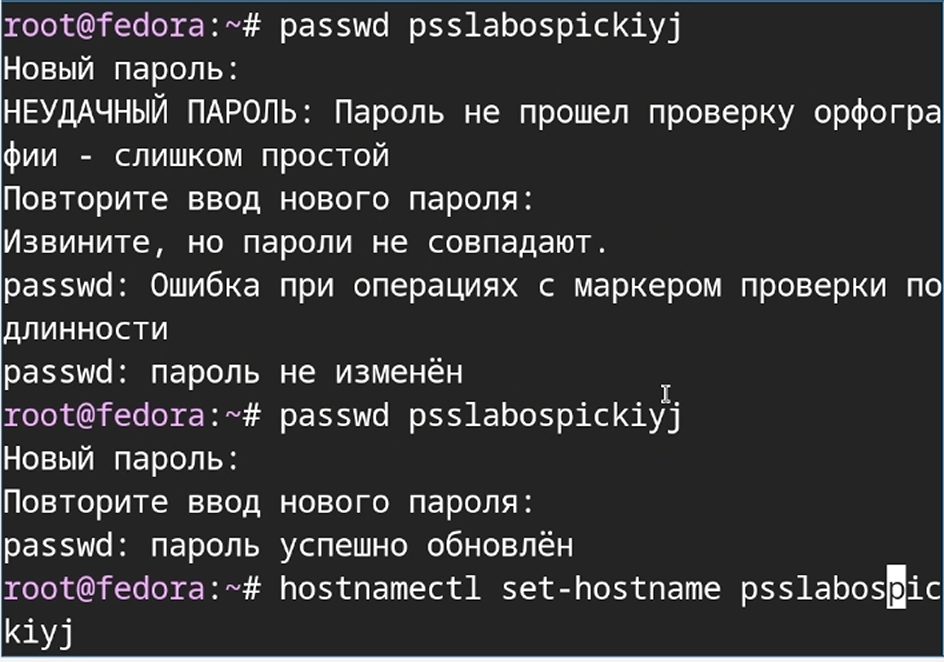{#fig:0 width=70%}

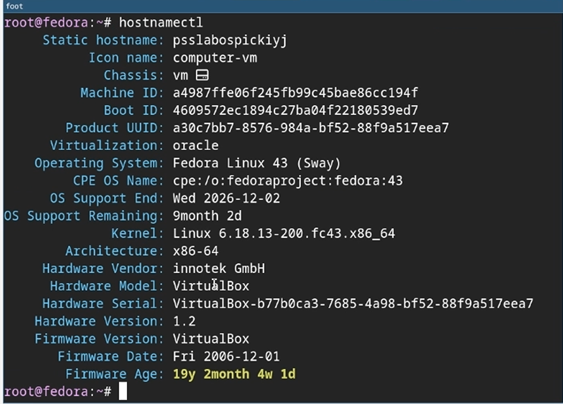{#fig:0 width=70%}

Для сдачи домашнего задания проведен анализ загрузки графического окружения командой dmesg | grep -i и сверка полученных данных с требуемым эталоном. ( Рис. 27 Рис. 28 Рис. 29 Рис. 30 Рис. 31)

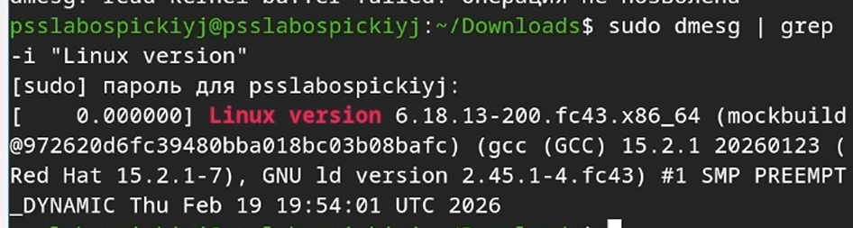{#fig:0 width=70%}

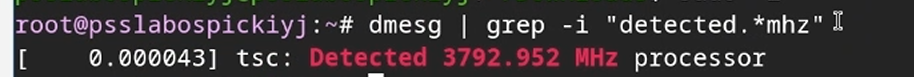{#fig:0 width=70%}

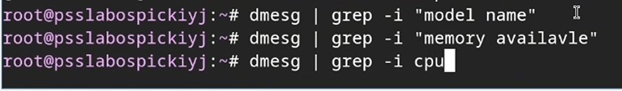{#fig:0 width=70%}

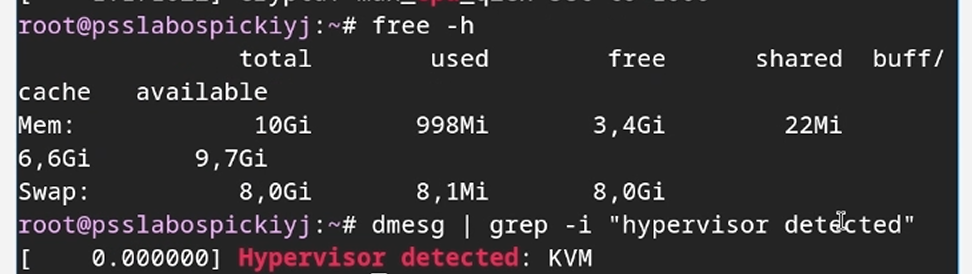{#fig:0 width=70%}

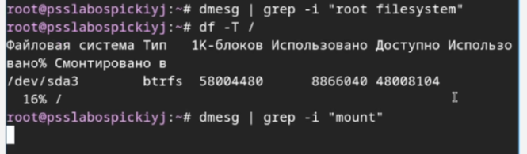{#fig:0 width=70%}

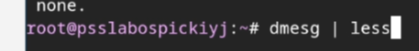{#fig:0 width=70%}

# Выводы

В рамках лабораторной работы были освоены базовые приемы конфигурирования виртуальной среды VirtualBox. Выполнены следующие этапы: создание виртуальной машины, установка ПО и настройка операционной системы.

# Список литературы{.unnumbered}

::: {#refs}
:::
