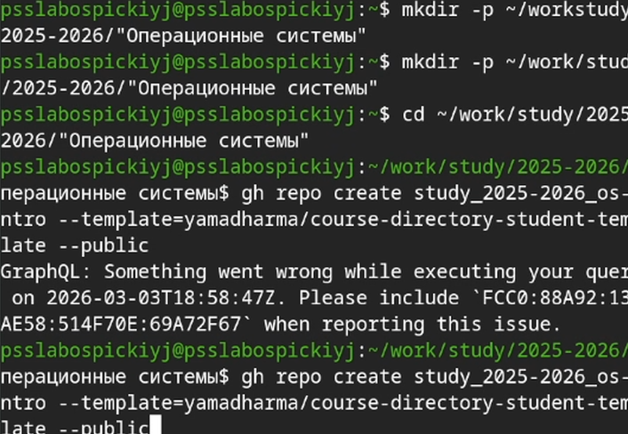

---
## Author
author:
  name: Слаюоспицкий Платон Сергеевич
  degrees: Бакалавр
  orcid: 0000-0002-0877-7063
  email: 1032253559@pfur.ru
  affiliation:
    - name: Российский университет дружбы народов
      country: Российская Федерация
      postal-code: 117198
      city: Москва
      address: ул. Миклухо-Маклая, д. 6

## Title
title: "Отчет по лабораторной номер 2"
subtitle: "ПЧистовой вариант"
license: "CC BY"
---

# Цель работы
Целью данной лабораторной работы является комплексное изучение теоретических основ и приобретение практических навыков работы с распределенными системами контроля версий (VCS) на примере Git.

# Задание
- Создать базовую конфигурацию для работы с git.
- Создать ключ SSH.
- Создать ключ PGP.
- Настроить подписи git.
- Зарегистрироваться на Github.
- Создать локальный каталог для выполнения заданий по предмету.
- Здесь приводится описание задания в соответствии с рекомендациями методического пособия и выданным вариантом.

# Теоретическое введение

## Системы контроля версий. Общие понятия
Системы контроля версий (Version Control System, VCS) применяются при работе нескольких человек над одним проектом. Обычно основное дерево проекта хранится в локальном или удалённом репозитории, к которому настроен доступ для участников проекта. При внесении изменений в содержание проекта система контроля версий позволяет их фиксировать, совмещать изменения, произведённые разными участниками проекта, производить откат к любой более ранней версии проекта, если это требуется.

В классических системах контроля версий используется централизованная модель, предполагающая наличие единого репозитория для хранения файлов. Выполнение большинства функций по управлению версиями осуществляется специальным сервером. Участник проекта (пользователь) перед началом работы посредством определённых команд получает нужную ему версию файлов. После внесения изменений, пользователь размещает новую версию в хранилище. При этом предыдущие версии не удаляются из центрального хранилища и к ним можно вернуться в любой момент. Сервер может сохранять не полную версию изменённых файлов, а производить так называемую дельта-компрессию — сохранять только изменения между последовательными версиями, что позволяет уменьшить объём хранимых данных.

Системы контроля версий поддерживают возможность отслеживания и разрешения конфликтов, которые могут возникнуть при работе нескольких человек над одним файлом. Можно объединить (слить) изменения, сделанные разными участниками (автоматически или вручную), вручную выбрать нужную версию, отменить изменения вовсе или заблокировать файлы для изменения. В зависимости от настроек блокировка не позволяет другим пользователям получить рабочую копию или препятствует изменению рабочей копии файла средствами файловой системы ОС, обеспечивая таким образом, привилегированный доступ только одному пользователю, работающему с файлом.

Системы контроля версий также могут обеспечивать дополнительные, более гибкие функциональные возможности. Например, они могут поддерживать работу с несколькими версиями одного файла, сохраняя общую историю изменений до точки ветвления версий и собственные истории изменений каждой ветви. Кроме того, обычно доступна информация о том, кто из участников, когда и какие изменения вносил. Обычно такого рода информация хранится в журнале изменений, доступ к которому можно ограничить.

В отличие от классических, в распределённых системах контроля версий центральный репозиторий не является обязательным.

Среди классических VCS наиболее известны CVS, Subversion, а среди распределённых — Git, Bazaar, Mercurial. Принципы их работы схожи, отличаются они в основном синтаксисом используемых в работе команд.

# Выполнение лабораторной работы

Установка Git и "gh"[@fig:02]

{#fig:02 width=70%}

Задаем имя и почту владельца репозитория, Настроим utf-8 в выводе сообщений git, Настроим верификацию и подписание коммитов git Зададим имя начальной ветки (будем называть её master), также Параметр autocrlf:[@fig:03]

{#fig:03 width=70%}

Задаем параметр safecrlf, смотрим свои характеристики, создаем ключ ssh:[@fig:04]

{#fig:04 width=70%}

Копируем из локальной консоли в буфер обмена, генерируем ключ gpg:[@fig:05]

{#fig:05 width=70%}

Задаем фразу пароль для gpg:[@fig:06]

{#fig:06 width=70%}

Внесли SSH-ключ в GitHub:[@fig:07]

{#fig:07 width=70%}

Внесли GPG-ключ в GitHub:[@fig:08]

{#fig:08 width=70%}

Копируем ключ GPG в буфер обмена,Используя введёный email, указываем Git применять его при подписи коммитов:[@fig:09]

{#fig:09 width=70%}
Авторизовываемся [@fig:10]
{#fig:10 width=70%}

Создаем шаблон рабочего пространства:[@fig-12][@fig-13][@fig-14]
{#fig:12 width=70%}
{#fig:13 width=70%}
{#fig:14 width=70%}

Удаляем лишние файлы, создаем необходимые каталоги, отправляем файлы на сервер:[@fig:15][@fig:16][@fig:17]
{#fig:15 width=70%}
{#fig:16 width=70%}
{#fig:17 width=70%}
# Выводы

Здесь кратко описываются итоги проделанной работы.

# Список литературы{.unnumbered}

::: {#refs}
:::
