---
## Author
author:
- name: Слабоспицкий Платон Сергеевич
  degrees: Бакалавр
  orcid: 0000-0002-0877-7063
  email: 1032253559@pfur.ru
  affiliation:
    - name: Российский университет дружбы народов
      country: Российская Федерация
      postal-code: 117198
      city: Moscow
      address: Улица Миклухо-Маклая, д. 6

## Title
title: "Отчет по лабороторной работе номер 2"
subtitle: "Настройка Git и GPG, работа с репозиторием"
license: "СС BY"
---

# Цель работы

Целью данной работы является получение навыков настройки рабочего пространства для работф с системой контроля версий Git, включая полную установку необходимого ПО, генерацию и привязку SSH и GPG ключей к аккаунту GitHub, а также выполнение базовых операций по клонированию репозитория и внесению изменений.

# Задание
1. Установка и первичная настройка Git.
2. Настройка парметров аутенфикации: генерации SSH-ключа и добавление его в аккаунт GitHub.
3. Генерации GPG-ключа, его экспорт и добавление в аккаунт GitHub для подписывания коммитов.
4. Настройка Git для использования GPG-подписи.
5. Аутентификация через GitHub CLI ('gh').
6. Создание рабочейй директории и клонирование репозитория. 
7. выполнение изменений в локальном репозитории и отправка их на удаленный сервер (push).

# Теоритическое введение

Система контроля версий Git является неотьемлемой инструментом современной разработки. Для безопасной и удобной работы с удаленными репозиториями (например, на GitHub) используются протоколы SSH и GPG. SSH-ключи обеспечивают безопасное соединение без необходимости ввода пароля при каждом обращении, а GPG-ключи позволяют подписывать коммиты, подтверждая их авторство и целостность.

# выполнение лабороторной работы

## 1. Установка и настройка Git

Так как Git уже был установлен в системе (пакет ''git-2.53.0-1.fc43.x86_64'), были выполнены команды для настройки глобальных и локальных параметров пользователя: установлено имя пользователя и email, отключено экранирование путей, задано имя начальной ветки, а также настроены параметры окончания строк ('autocrlf') и их провкерки ('safecrlf') (рис. @fig:002, @fig:003, @fig:004).

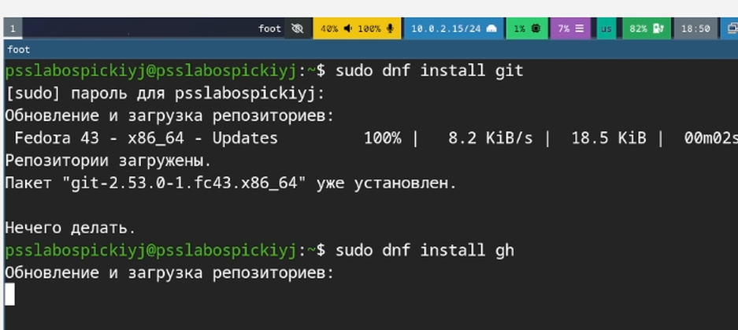{#fig:002 width=70%}
{#fig:003 width=70%}
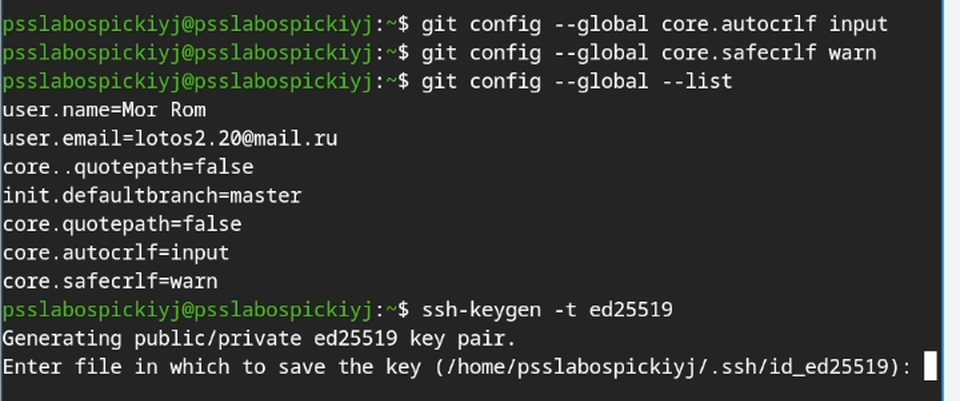{#fig:004 width=70%}
## 2. Генерация и добавлние SSH-ключа
Для аутенцикации на GitHub по протоколу SSH был сгенерирован новый ключ по алгоритму 'ed25519'. После генерации содержимое публичного ключа было скопировано в буфер обмена с помощью утилиты 'wl-copy' (рис. @fig:005).

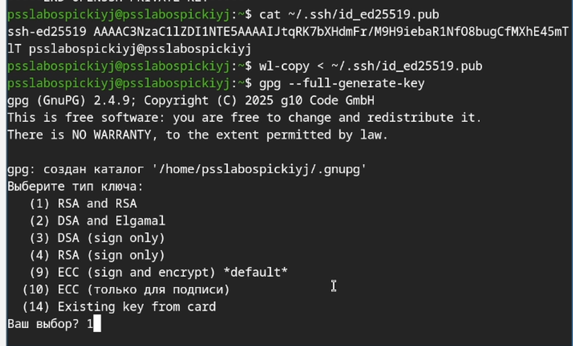{#fig:005 width=70%}

На веб-интерфейсе GitHub в разделе настроек SSH и GPG keys был добавлен новый SSH ключ с названием 'FEdora lab' (рис. @fig:007, @fig:008).

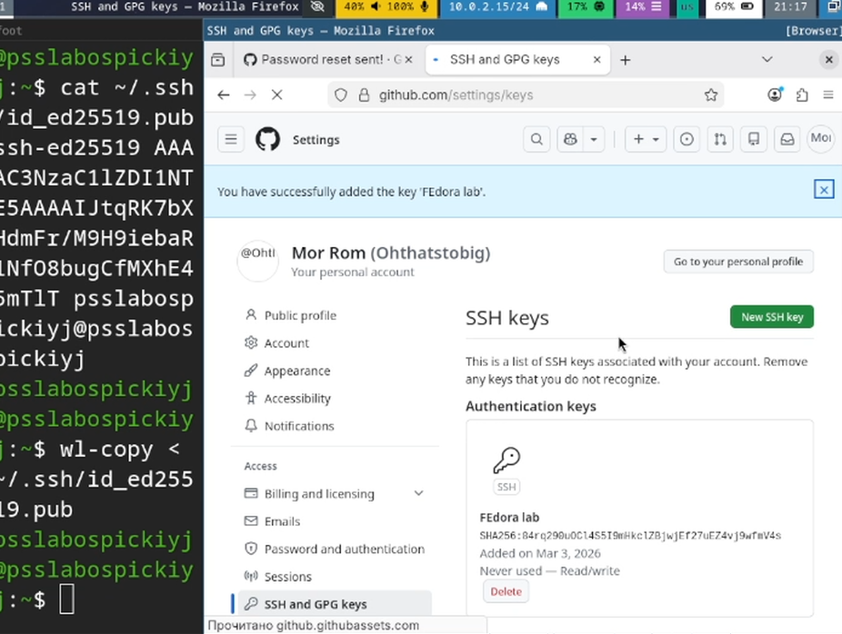(#fig:007 width=70%}

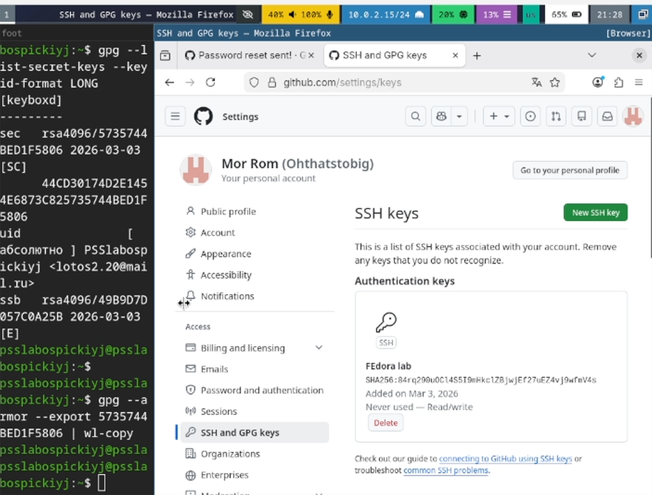{#fig:008 width=70%).

## 3. Генерация и настройка GPG-ключа

Для подписывания коммитов был сгенерирован GPG-ключ. В процессе генерации был выбран тип ключа (RSA and RSA), указаны полное имя пользователя и email (рис. @fig:005, @fig:006).

{#fig:005-dup width=70%}

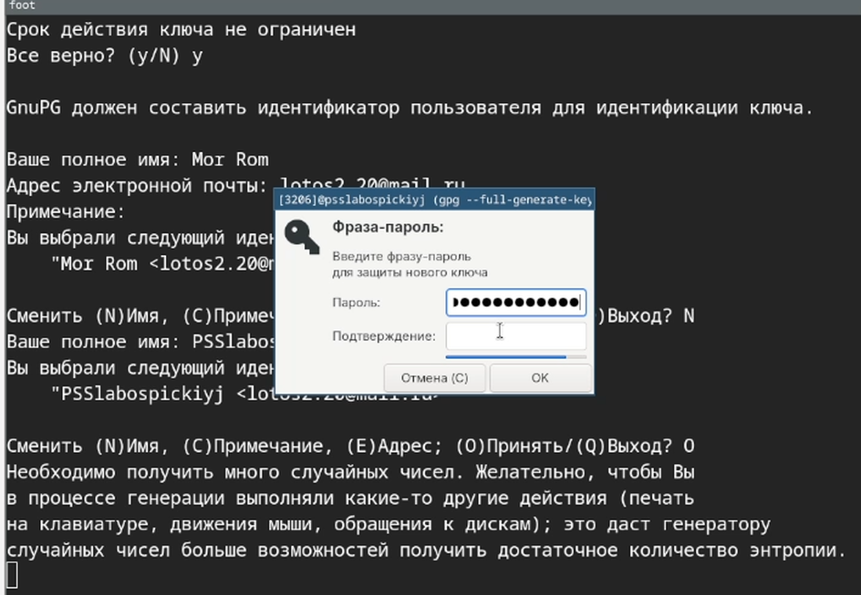{#fig:006 width=70%}
После генерации ключа был получен его отпечаток и экспортирован публичный ключ в буфер обмена для добавления на GitHub (рис. @fig:009). Затем в глобальной конфигурации Git был указан ключ для подписи и включена автоматическая подпись всех коммитов. Также была допущена опечатка в команде вызова "gh" но позднее исправил. (рис. @fig:009, @fig:010).

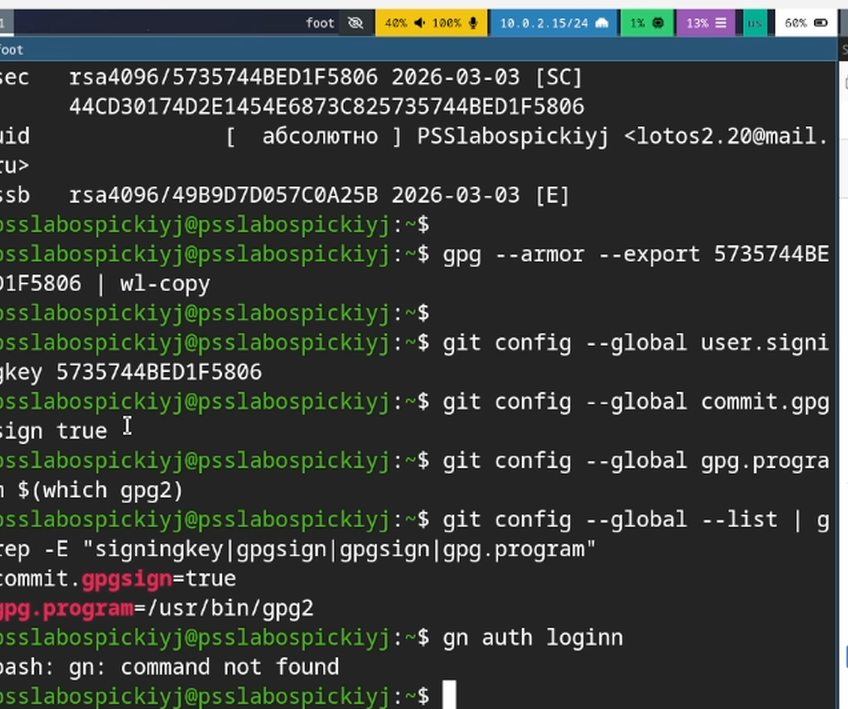{#fig:009 width=70%}

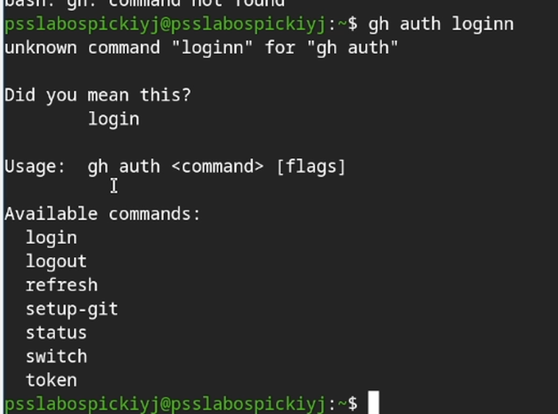{#fig:010 width=70%}

## 4.Аутентификация через GitHub CLI

Для успрощения взаимодействия с GitHub была выполнена аутентификация через утилиту "gh". В процессе были выбраны: хостинг GitHub.com, протокол SSH, уже следующий публичный ключ. Для подтверждения потребовалось ввести одноразовый код в браузере (рис. @fig:011).

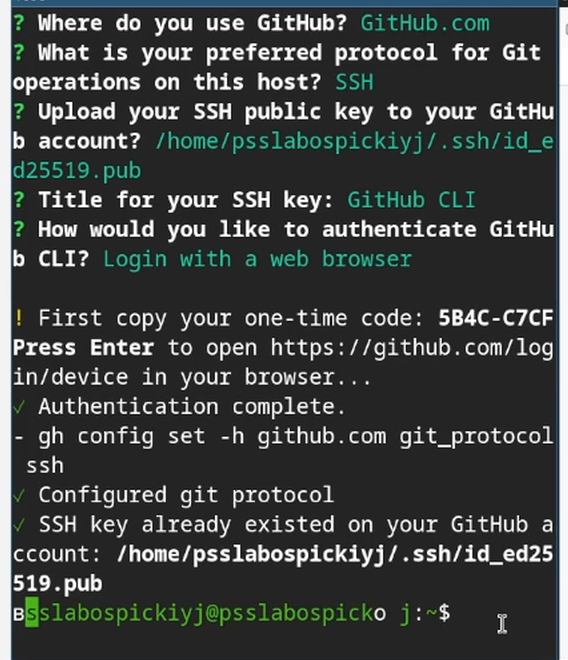{#fig:011 width=70%}

## 5. Клонирование репозитория и работа с ним

Была создана структура директорий для лабораторных работ. После перехода в целевую аудиторию была предпринята попытка клонирования репозитория. Первые попытки завершились ошибкой из-зи некоректного указанного символа в URL (запятая вместо точки) и опечатки в имени пользвоателя (рис. @fig:013). После исправления URL клонирование начаолось, но система запросила подтверждение подлинности хоста 'github.com'. После подтверждения ('yes') хост был добавлен в список известных, и репозиторий успешно склонирован (рис. @fig:014).

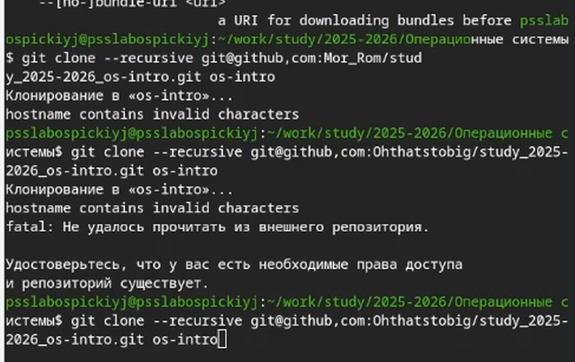{#fig:013 width=70%}

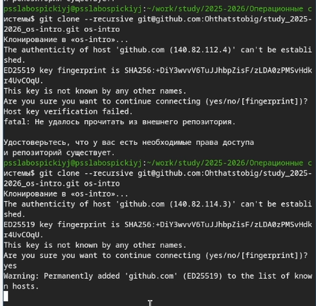{#fig:014 width=70%}

## 6. Выполнение и подпись коммита

При первой попытке создать коммит произошла ошибка подписи GPG. Система не смогла найти секретный ключ для пользователя "Mor Rom <lotos2.20@mail.ru>". После повторной явной установки ключа подписи в конфигурации Git коммит был успешно создан и подписан, а затем отправлен на удаленный сервеР (рис. @fig:016).

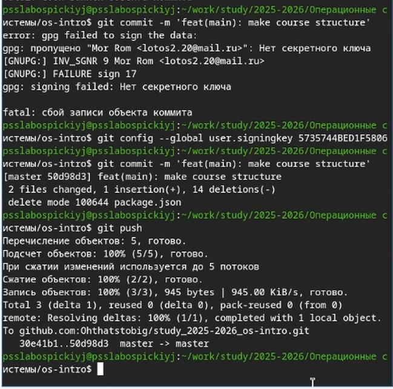{#fig:016 width=70%}

## 7. Дальнейшая работа с репозиторием

В ходе дальнейшего работы был удален ненужный файд "package.json' и создан файл 'COURSE'. С помощью Makefile была выполнена генерация структуры каталогов и обновление подмодулей. Изменения были добавлены в индекс и подготовлены к новому коммиту (рис. @fig:015, @fig:017).

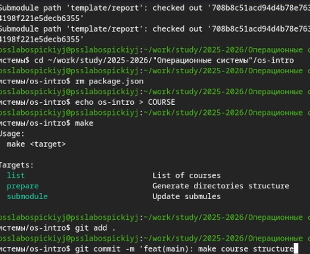{#fig:015 width=70%}

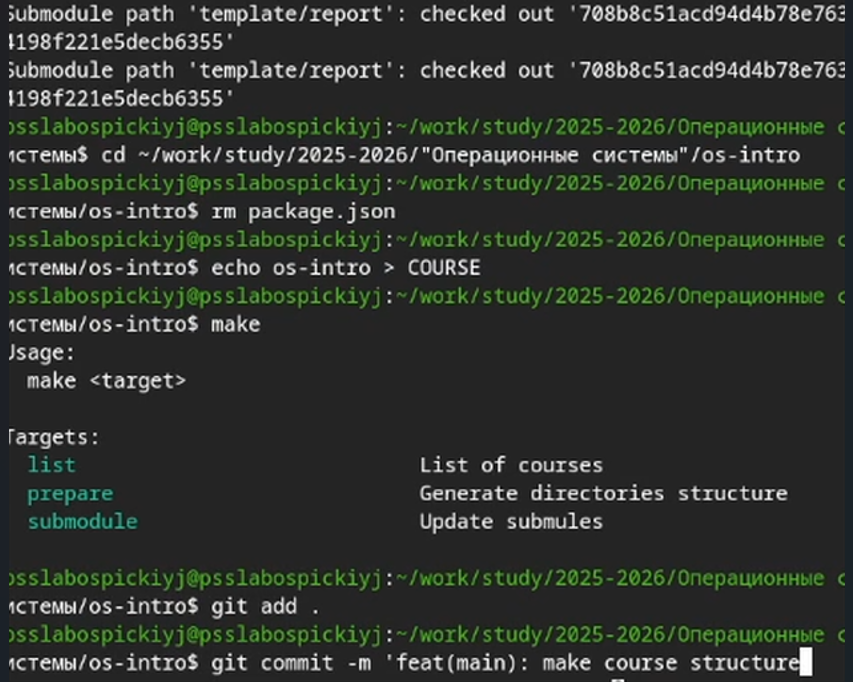{#fig:017 width=70%}

# Выводы

В ходе выполнения лабораторной работы были успешно решены следующие задачи:
* Произведена юазовая настройка Git
* Сгенерированы и добавлены в аккаунт GitHub SSH и GPG ключи
* Настроено автоматическое подписывание коммитов GPG-ключом
* Выполнено елонирование удаленного репозитория по SSH
* Внесены изменения в локальную копию репозитория, создан подписанный коммит и отправлен на удаленный сервер

Полученные навыки позваоляют эффективно и безопасно работать с системой контроля версии Git и платформой GitHub

# Список литературы{.unnumbered}

::: {#refs}
:::
