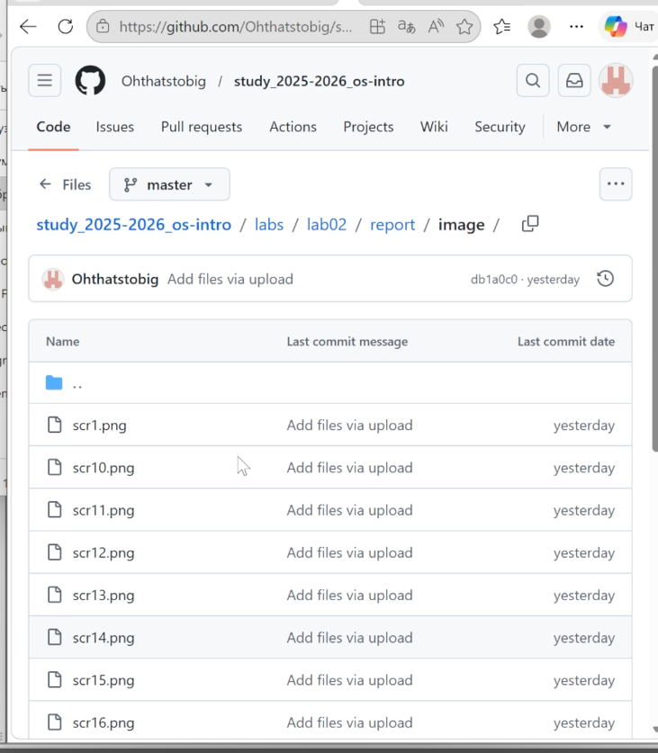
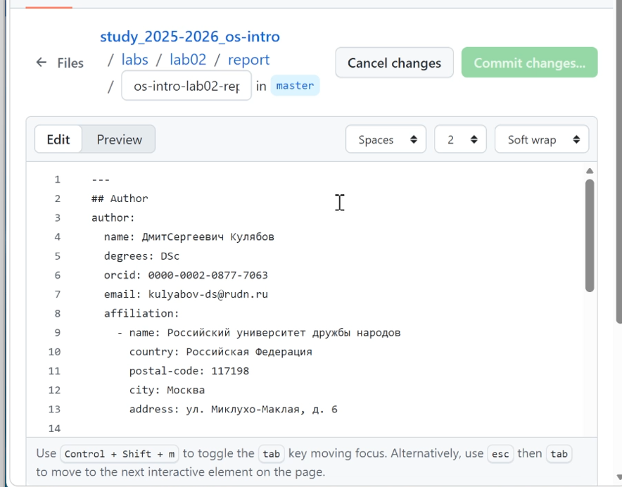
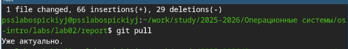
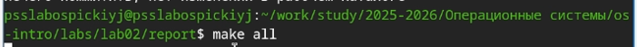
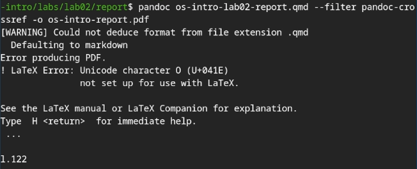
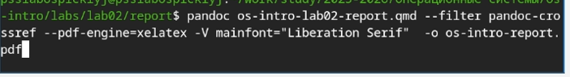
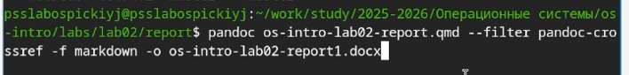
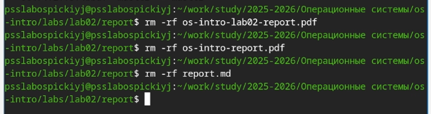
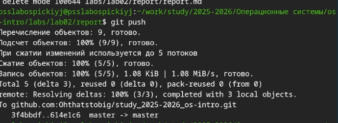

---
## Author
author:
  name: Слабоспицкий Платон Сергеевич
  degrees: Бакалавр
  orcid: 0000-0002-0877-7063
  email: 1032253559@pfur.ru
  affiliation:
    - name: Российский университет дружбы народов
      country: Российская Федерация
      postal-code: 117198
      city: Москва
      address: ул. Миклухо-Маклая, д. 6

## Title
title: "Отчет по лабораторной номер 3"
subtitle: "ПЧистовой вариант"
license: "CC BY"
---

# Цель работы
Научиться оформлять отчёты с помощью легковесного языка разметки Markdown.

# Задание
- Оформите отчет по предыдущей лабораторной работе с использованием синтаксиса Markdown.
- Готовый отчет необходимо предоставить в трех форматах: PDF, DOCX и MD. Файлы следует упаковать в архив, так как он также должен содержать скриншоты, Makefile и прочие сопутствующие материалы.

# Теоретическое введение

При верстке отчета придерживайтесь следующих правил Markdown:

Заголовки создаются символом #.

Для выделения текста используйте двойные **жирный**, одинарные *курсив* и тройные ***жирный курсив*** звездочки.

Цитаты оформляются символом >.

Для списков используйте звездочки (*), дефисы (-) или нумерацию. Вложенные пункты создаются отступами.

Ссылки имеют формат [текст ссылки](имя_файла.md).

Код можно встраивать в текст или выносить в отдельные блоки.

Математические формулы вводятся согласно синтаксису LaTeX.
Для конвертации файлов используйте Pandoc (с расширениями pandoc-citeproc и pandoc-crossref). Примеры команд:

pandoc README.md -o README.pdf

pandoc README.md -o README.docx

Для автоматизации процесса сборки подготовьте Makefile со следующим содержимым:

FILES = $(patsubst %.md, %.docx, $(wildcard *.md))

FILES += $(patsubst %.md, %.pdf, $(wildcard *.md)

# Выполнение лабораторной работы

Заранее сделав скриншоты работы приступаю к написанию отчета по лабороторной работе номер 2. Проверяю наличие скриншотов в папке репозитория:
{#fig:01 width=70%}

открываю шаблон отчета в github.com, начинаю изменять его под себя и соответствеенно пишу отчет
{#fig:02 width=70%}
Загружаю готовый отчет на локальный репозиторий в Fedora Sway
{#fig:03 width=70%}

При попытке воспользоваться Make all вижу наличие ошибок и оставляю этот метод как не очень удобный 
{#fig:04 width=70%}
Пытаюсь конверттировать файл с отчетом в pdf стандартным методом, но получаю ошибки и модернизирую метод под свою ситуацию
{#fig:05 width=70%}
применение модернизироноваго метода конвертации и получение корректного файла pdf
{#fig:06 width=70%}
применение стандартного метода конвертации и получение корректного файла docx
{#fig:07 width=70%}
Удаляю из репоззитория неудачные попытки написания отчета или преобразование его в другой формат
{#fig:08 width=70%}
загружаю финальные изменения на сервер
{#fig:09 width=70%}

# Выводы

В результате выполнения лабораторной работы были освоены принципы оформления отчетов с импользованием языка разметки Markdown.

# Список литературы{.unnumbered}

::: {#refs}
:::
