---
## Author
author:
  name: Слабоспицкий Платон Сергеевич
  degrees: Бакалавр
  orcid: 0000-0002-0877-7063
  email: 1032253559@pfur.ru
  affiliation:
    - name: Российский университет дружбы народов
      country: Российская Федерация
      postal-code: 117198
      city: Москва
      address: ул. Миклухо-Маклая, д. 6

## Title
title: "Отчет по лабораторной номер 4"
subtitle: "Чистовой вариант"
license: "CC BY"
---

# Цель работы
Научиться правильно работать с Git, используя две крутые штуки: Gitflow (удобная организация веток) и Conventional Commits (осмысленные комментарии к коммитам).
# Задание

# Теоретическое введение

1. Gitflow — как организуем ветки
Вместо одной вечной ветки master используем две основные:
master — тут только готовые релизы.
develop — тут ведется основная разработка.
Типы временных веток:
feature — для новых функций. Создается от develop, сливается обратно в develop.
release — для подготовки релиза. Создается от develop, сливается в master (с тегом версии) и в develop.
hotfix — для срочных исправлений багов на проде. Создается от master, сливается в master и develop.
2. Семантическое версионирование (SemVer)
Версия всегда пишется как МАЖОРНАЯ.МИНОРНАЯ.ПАТЧ.
ПАТЧ (1.0.1) — просто починили баг.
МИНОРНАЯ (1.1.0) — добавили новую фичу, всё работает по-старому.
МАЖОРНАЯ (2.0.0) — всё сломали (изменения несовместимы со старыми версиями).
3. Conventional Commits — как пишем коммиты
Нужно, чтобы по названию коммита было сразу понятно, что сделали и какую версию увеличивать.
Формат: <тип>: <описание>
Главные типы:
fix: — исправили баг (-> увеличивается ПАТЧ).
feat: — добавили новую функцию (-> увеличивается МИНОРНАЯ).
BREAKING CHANGE: — если есть этот текст (-> увеличивается МАЖОРНАЯ).
Остальные популярные типы:
docs: — правки в документации.
style: — форматирование кода.
refactor: — переписывание кода без изменения логики.
test: — правки в тестах.
chore: — обновление служебных файлов (например, changelog).

# Выполнение лабораторной работы

установка git-flow (Рис 1 и 2)

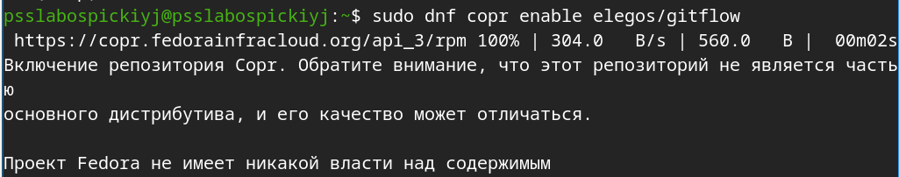{#fig:01 width=70%}

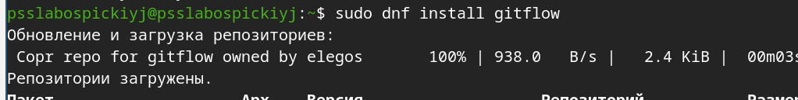{#fig:01 width=70%}

установка Node.js (Рис 3 и 4)

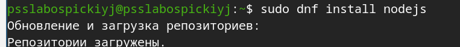{#fig:01 width=70%}

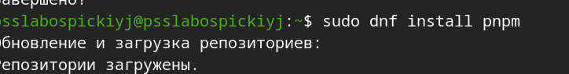{#fig:01 width=70%}

Настройка Node.js (Рис 5)

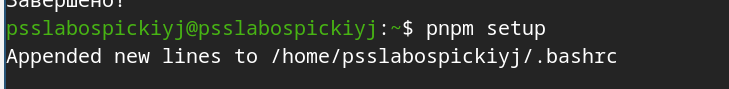{#fig:01 width=70%}

При помощи программы commitizen устанавливаем git-cz (Рис 6)

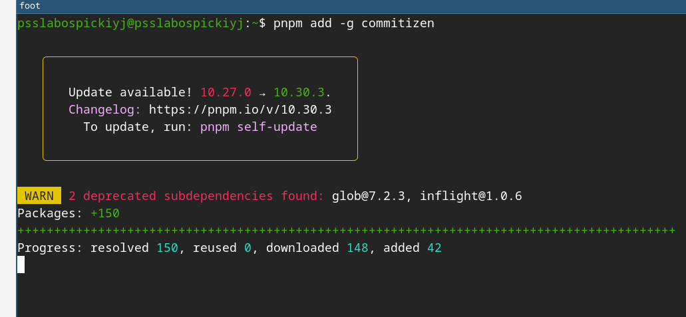{#fig:01 width=70%}

Данная программа используется для помощи в создании логов.(Рис 7)

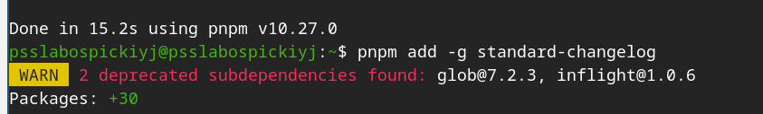{#fig:01 width=70%}

Делаем первый коммит и выкладываем на github и он не получается соответственно создаем файл README и инициализируем репозиторий и после делаем первый коммит и выкладываем на гитхаб(рис 8,9)

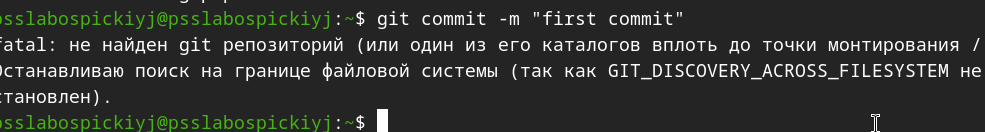{#fig:01 width=70%}

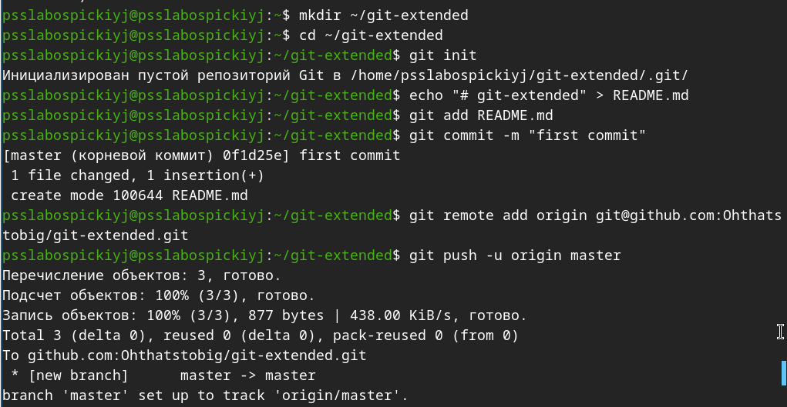{#fig:01 width=70%}

Провожу конфигурацию общепринятых коммитов(Рис 10, 11, 12)

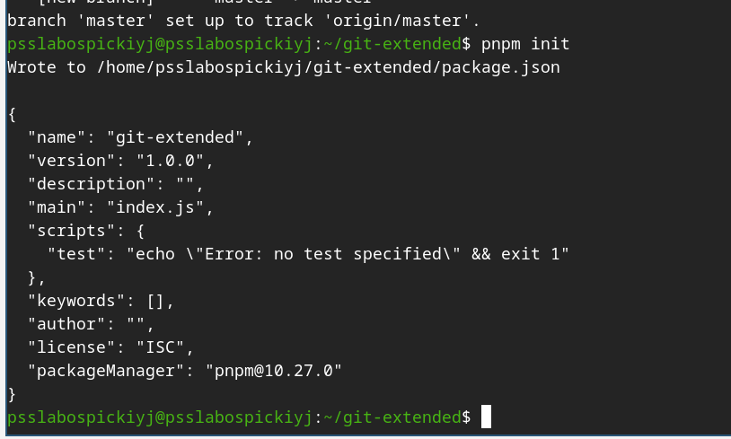{#fig:01 width=70%}

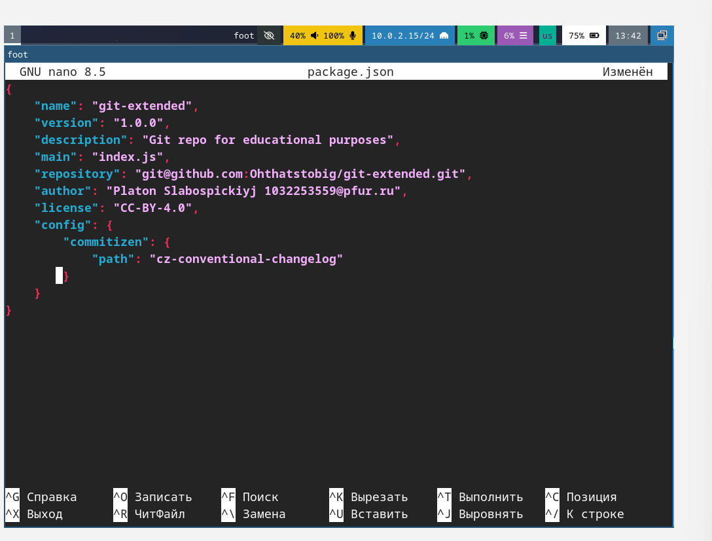{#fig:01 width=70%}

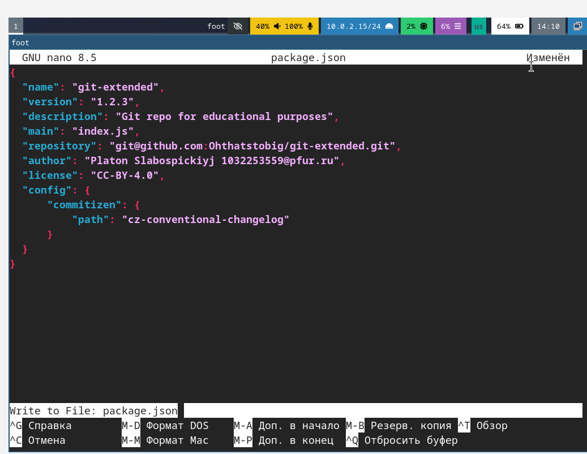{#fig:01 width=70%}

Добавляю норвые файлы, коммичу и отправляю на гитхаб(рис. 13)

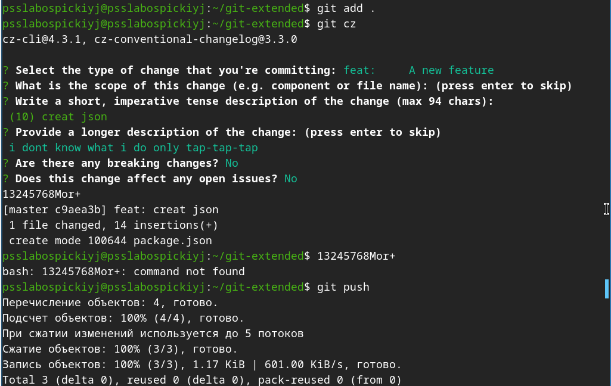{#fig:01 width=70%}

Инициализируем git-flow, проверяю что на ветке develop (Рис 14)

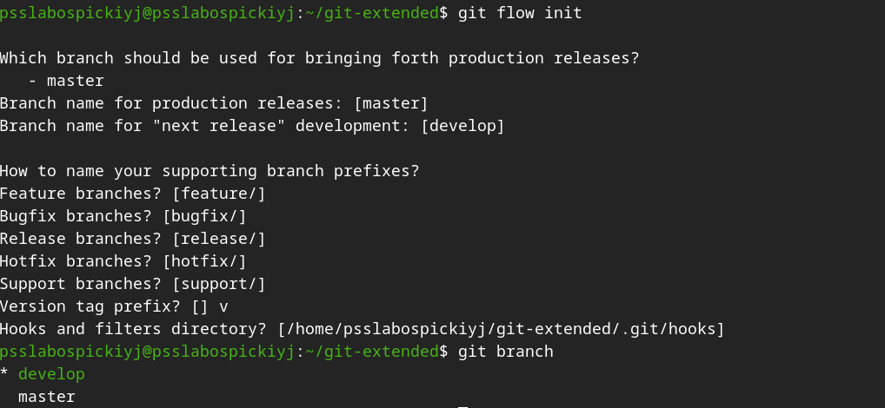{#fig:01 width=70%}

Загрузите весь репозиторий в хранилище(Рис 15)

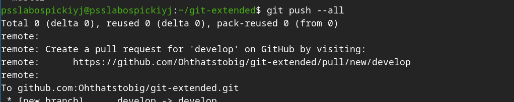{#fig:01 width=70%}

Устанавливаю внешнюю ветку как вышестоящую(Рис 16)

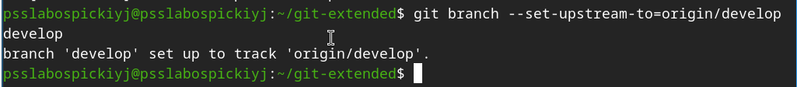{#fig:01 width=70%}

Создаю релиз с версией start 1.0.0 (Рис 17)

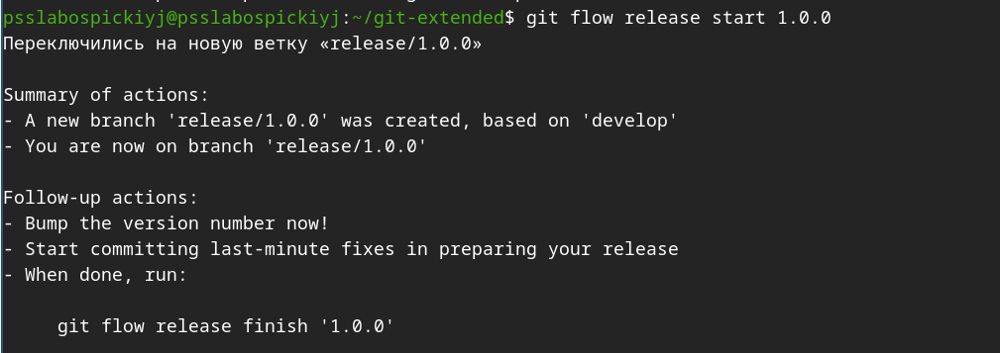{#fig:01 width=70%}

Создаю Журнал изменений и добавляю в меню(Рис 18,19,20,21)

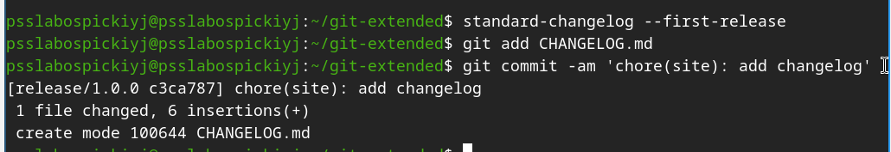{#fig:01 width=70%}

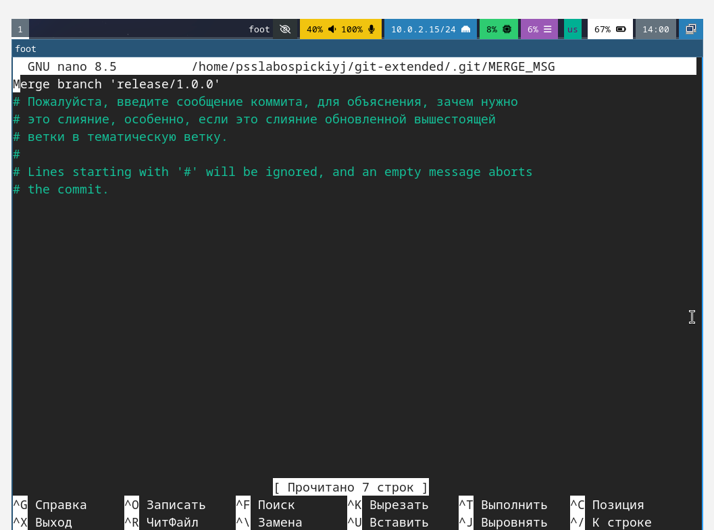{#fig:01 width=70%}

{#fig:01 width=70%}

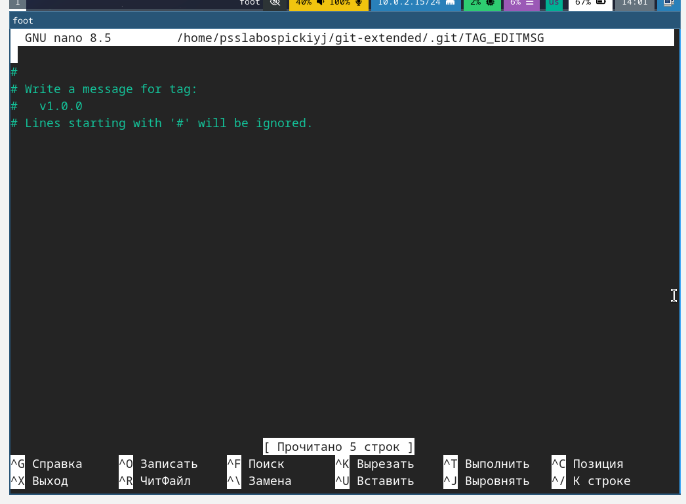{#fig:01 width=70%}

Заливаем релизную ветку в основную ветку(Рис 22)

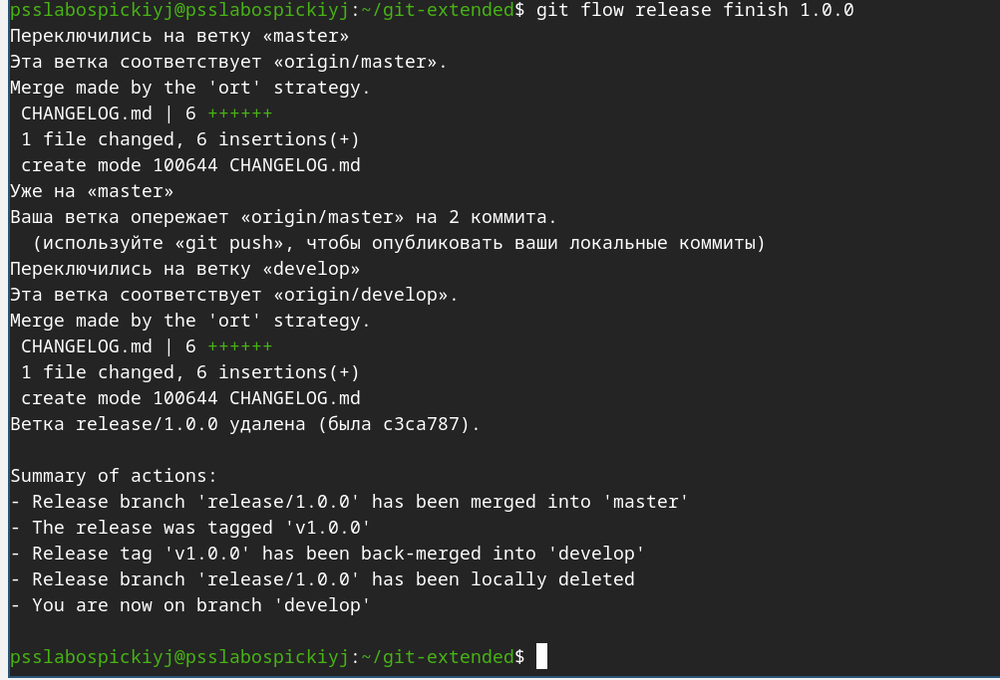{#fig:01 width=70%}

Создадим релиз на github. Для этого будем использовать утилиты работы с github(Рис 22)

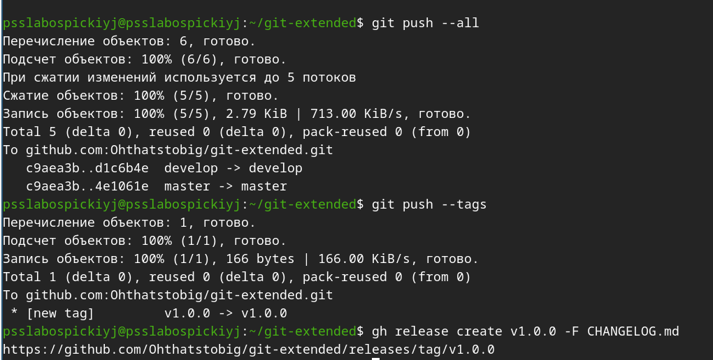{#fig:01 width=70%}

Создадим ветку для новой функциональности(Рис 23)

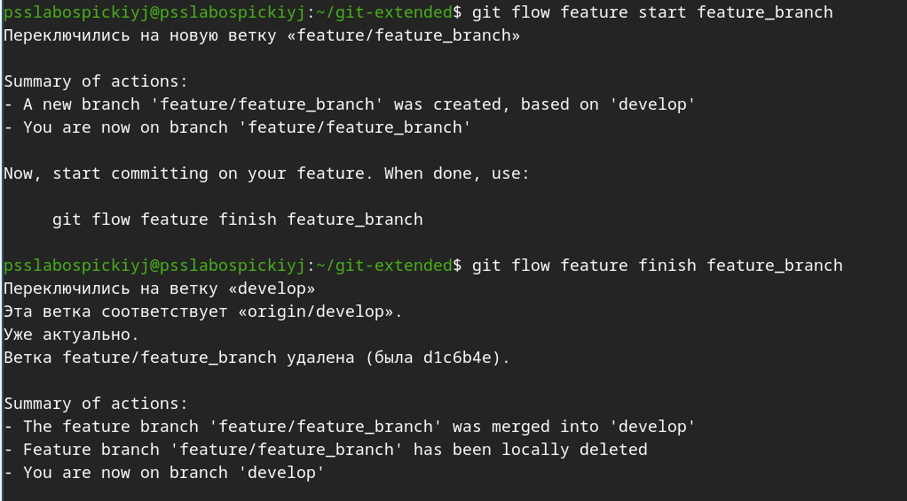{#fig:01 width=70%}

Создание релиза git-flow и добавляем журнал изменений в индекс, потом заливаем пклмщную ветку в основную(Рис 24)

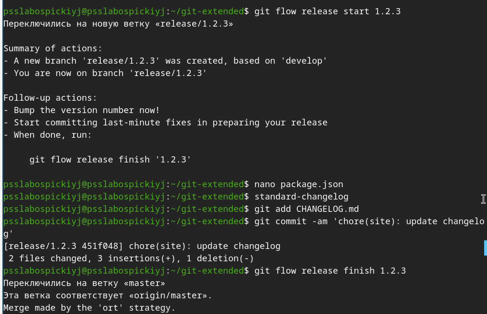{#fig:01 width=70%}

Отправляем данные на гитхаб и создаем релиз с комментариями из журнала изменений(Рис 25)

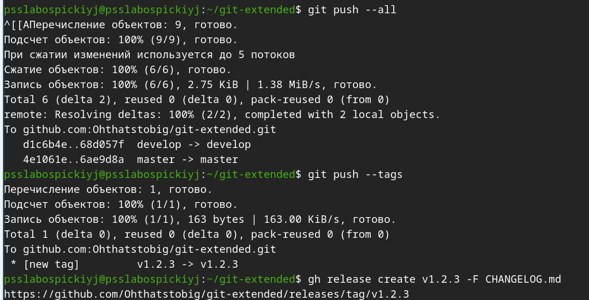{#fig:01 width=70%}

# Выводы

Научились структуре гитфлоу и тому как создават, сливать ветки репозитория. Просто установили весь нужный софт.

# Список литературы{.unnumbered}

::: {#refs}
:::
