---
## Author
author:
  name: Слабоспицкий Платон Сергеевич
  degrees: Бакалавр
  orcid: 0000-0002-0877-7063
  email: 1032253559@pfur.ru
  affiliation:
    - name: Российский университет дружбы народов
      country: Российская Федерация
      postal-code: 117198
      city: Москва
      address: ул. Миклухо-Маклая, д. 6

## Title
title: "Отчет по лабораторной номер 5"
subtitle: "Чистовой вариант"
license: "CC BY"
---

# Цель работы
Изучение менеджера паролей pass и системы управления конфигурационными файлами chezmoi, приобретение практических навыков их установки, настройки и использования для безопасного хранения паролей и управления dotfiles.
# Задание
- Установить менеджер паролей pass в операционной системе Fedora.
- Сгенерировать GPG-ключ для шифрования хранилища паролей.
- Инициализировать хранилище паролей и настроить его синхронизацию с Git-репозиторием.
- Освоить основные операции с паролями (добавление, просмотр, редактирование, генерация).
- Установить и настроить плагин browserpass для интеграции с веб-браузером.
- Установить систему управления конфигурационными файлами chezmoi.
- Создать собственный репозиторий для хранения dotfiles на GitHub.
- Настроить управление конфигурационными файлами с помощью шаблонов chezmoi.
- Изучить основные команды chezmoi для работы с конфигурацией на нескольких машинах.
- Протестировать синхронизацию конфигурации между различными компьютерами

# Теоретическое введение
1. Менеджер паролей pass
pass — программа, сделанная в рамках идеологии Unix. Также носит название стандартного менеджера паролей для Unix (The standard Unix password manager).

1.1. Основные свойства
Данные хранятся в файловой системе в виде каталогов и файлов.

Файлы шифруются с помощью GPG-ключа.

1.2. Структура базы паролей
Структура базы может быть произвольной, если используется напрямую, без промежуточного программного обеспечения. Семантика структуры базы данных хранится в голове пользователя.

Если же необходимо использовать дополнительное программное обеспечение, необходимо семантику заложить в структуру базы паролей.

1.3. Семантическая структура базы паролей
Рассмотрим пользователя user в домене example.com, порт 22.

Отсутствие имени пользователя или порта в имени файла означает, что любое имя пользователя и порт будут совпадать:

text
example.com.gpg
Соответствующее имя пользователя может быть именем файла внутри каталога, имя которого совпадает с хостом. Это полезно, если в базе есть пароли для нескольких пользователей на одном хосте:

text
example.com/user.gpg
Имя пользователя также может быть записано в виде префикса, отделенного от хоста знаком @:

text
user@example.com.gpg
Соответствующий порт может быть указан после хоста, отделённый двоеточием (:):

text
example.com:22.gpg
example.com:22/user.gpg
user@example.com:22.gpg
Все эти записи могут быть расположены в произвольных каталогах, задающих собственную иерархию.

1.4. Реализации
Утилиты командной строки
Существует 2 основные реализации:

pass — классическая реализация в виде shell-скриптов (https://www.passwordstore.org/)

gopass — реализация на Go с дополнительными интегрированными функциями (https://www.gopass.pw/)

Графические интерфейсы
qtpass — может работать как графический интерфейс к pass, так и как самостоятельная программа. В настройках можно переключаться между использованием pass и gnupg.

gopass-ui — интерфейс к gopass.

webpass — веб-интерфейс к pass (https://github.com/emersion/webpass)

Приложения для Android
Password Store (https://play.google.com/store/apps/details?id=dev.msfjarvis.aps) — для синхронизации с git необходимо импортировать ssh-ключи. Поддерживает разблокировку по биометрическим данным. Для работы требует наличия OpenKeychain: Easy PGP.

OpenKeychain: Easy PGP (https://play.google.com/store/apps/details?id=org.sufficientlysecure.keychain) — операции с ключами PGP. Необходимо импортировать PGP-ключи. Не поддерживает разблокировку по биометрическим данным.

Пакеты для Emacs
pass — основной режим для управления хранилищем и редактирования записей (https://github.com/NicolasPetton/pass)

helm-pass — интерфейс helm для pass (https://github.com/emacs-helm/helm-pass)

ivy-pass — интерфейс ivy для pass (https://github.com/ecraven/ivy-pass)

2. Управление файлами конфигурации с помощью chezmoi
chezmoi — инструмент для управления файлами конфигурации домашнего каталога пользователя.

Сайт: https://www.chezmoi.io/

Репозиторий: https://github.com/twpayne/chezmoi

2.1. Общая информация
Состояние файлов конфигурации сохраняется в каталоге ~/.local/share/chezmoi. Он является клоном репозитория dotfiles.

Файл конфигурации ~/.config/chezmoi/chezmoi.toml (можно использовать также JSON или YAML) специфичен для локальной машины.

Файлы, содержимое которых одинаково на всех машинах, дословно копируются из исходного каталога. Файлы, которые варьируются от машины к машине, выполняются как шаблоны, обычно с использованием данных из файла конфигурации локальной машины.

При запуске chezmoi apply вычисляется желаемое содержимое и разрешения для каждого файла, а затем вносятся необходимые изменения.

# Выполнение лабораторной работы

установлены пакеты pass,pass-otp для работы с менеджером паролей, а также 
go pass — реализация менеджера паролей на Go с дополнительными функциями 
sudo dnf install pass pass-otp
sudo dnf install gopass

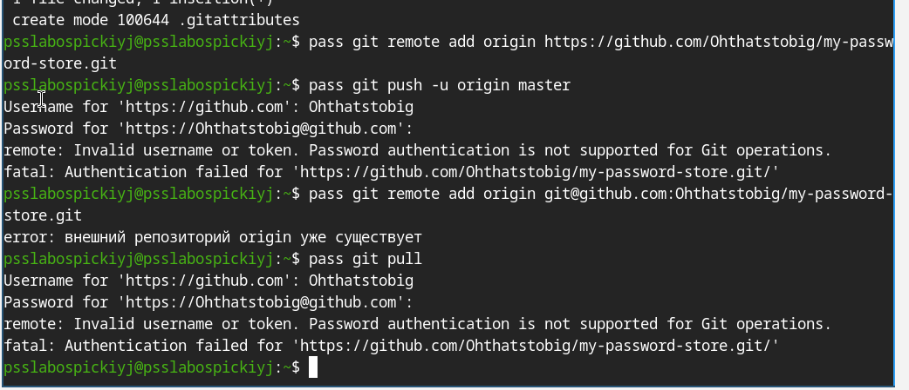{#fig:01 width=70%}

Выполнена проверка наличия GPG-ключей и создан новый ключ для шифро
вания хранилища паролей 
gpg--list-secret-keys
gpg--full-generate-key

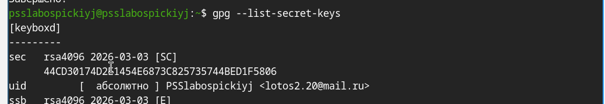{#fig:02 width=70%}

Инициализировано хранилище паролей с использованием GPG-ключа, создана
git-структура и подключён удалённый репозиторий на GitHub
pass init lotos2.20@mail.ru
pass git init
pass git remote add origin git@github.com:/.git

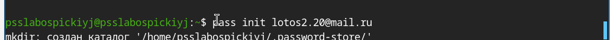{#fig:03 width=70%}

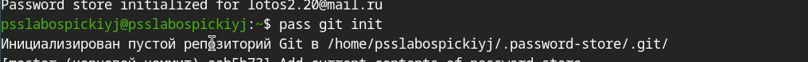{#fig:04 width=70%}

Добавлен тестовый пароль в хранилище, выполнена синхронизация с удалён
ным репозиторием на GitHub
pass insert email/test@example.com
pass git push-u origin master
pass git status

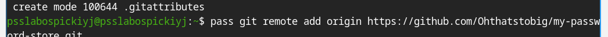{#fig:05 width=70%}

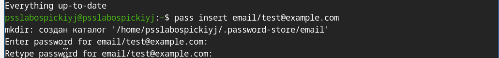{#fig:06 width=70%}

Для взаимодействия с браузером подключён репозиторий Copr и установлен
пакет browserpass, обеспечивающий интерфейс native messaging
sudo dnf copr enable maximbaz/browserpass
sudo dnf install browserpass

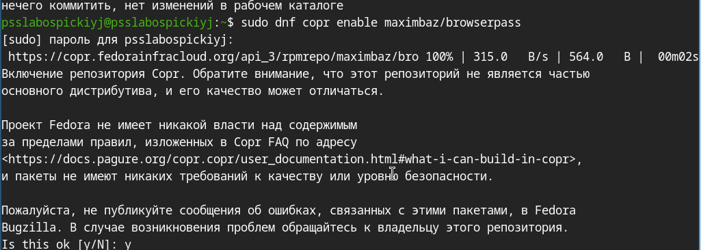{#fig:07 width=70%}

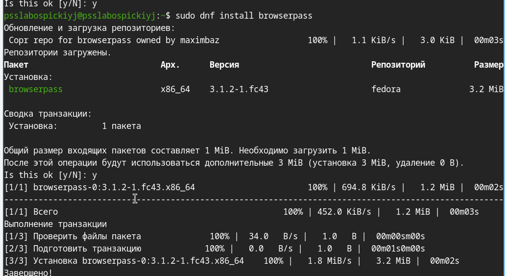{#fig:08 width=70%}

Установлены дополнительные пакеты, необходимые для работы рабочей среды

sudo dnf-y install \
  dunst \
  fontawesome-fonts \
  powerline-fonts \
  light \
  fuzzel \
  swaylock \
  kitty \
  waybar swaybg \
  wl-clipboard \
  mpv \
  grim \
  slurp
  
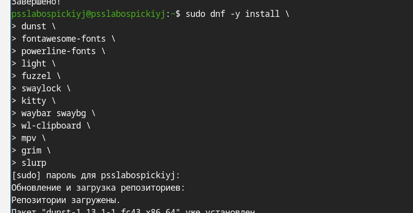{#fig:09 width=70%}

Подключён репозиторий Copr и установлены шрифты семейства Iosevka
sudo dnf copr enable peterwu/iosevka
sudo dnf install iosevka-fonts iosevka-aile-fonts iosevka-curly-fonts \
iosevka-slab-fonts iosevka-etoile-fonts iosevka-term-fonts

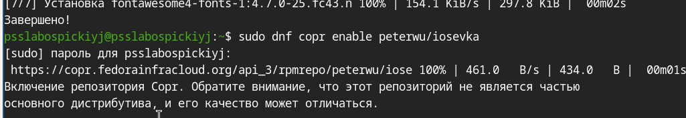{#fig:10 width=70%}

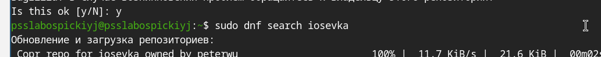{#fig:11 width=70%}

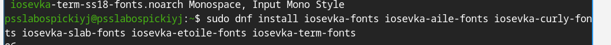{#fig:12 width=70%}

Установлен бинарный файл c hezmoi с помощью скрипта, а также создан при
ватный репозиторий dotfiles на GitHub на основе шаблона
sh-c "$(wget-qO- chezmoi.io/get)"
chezmoi--version
gh repo create dotfiles--template="yamadharma/dotfiles-template"--private

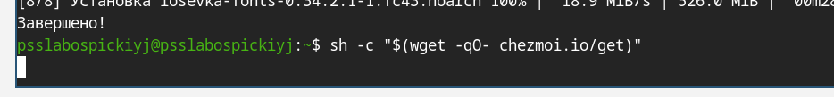{#fig:13 width=70%}

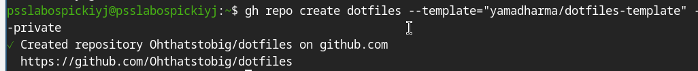{#fig:14 width=70%}

Выполнена инициализация chezmoi с репозиторием dotfiles и применены
изменения в домашнем каталоге
chezmoi init git@github.com:lebedev-s-a/dotfiles.git
chezmoi diff
chezmoi apply-v

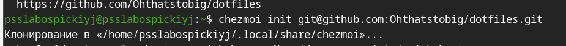{#fig:15 width=70%}

Настроенаавтоматическаяфиксацияиотправкаизменений.Выполненапро
верка синхронизации:полученыпоследниеизмененияизрепозиторияиприме
неныкдомашнемукаталогу

chezmoi apply-v
nano ~/.config/chezmoi/chezmoi.toml
chezmoi update
chezmoi git pull----autostash--rebase && chezmoi diff
[git]
autoCommit = true
autoPush = true

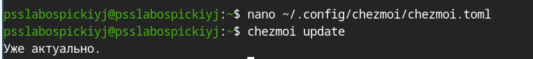{#fig:16 width=70%}

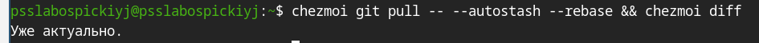{#fig:17 width=70%}

1. Что такое менеджер паролей pass?
Pass — стандартный менеджер паролей для Unix, реализованный в виде shell-скриптов. Данные хранятся в файловой системе в виде каталогов и файлов, каждый из которых зашифрован с помощью GPG-ключа. Поддерживает синхронизацию через git и взаимодействие с браузером через native messaging.

2. Что такое chezmoi?
Chezmoi — инструмент для управления файлами конфигурации домашнего каталога пользователя между несколькими машинами. Использует git-репозиторий (dotfiles) для хранения состояния конфигурационных файлов. Поддерживает шаблоны на синтаксисе Go для создания конфигураций, специфичных для конкретной машины.

3. Что хранится в файле конфигурации ~/.config/chezmoi/chezmoi.toml?
В этом файле хранятся локальные настройки chezmoi, специфичные для конкретной машины: данные шаблонов (раздел data), настройки git (автокоммит, автопуш), а также другие параметры, которые не должны быть одинаковыми на всех машинах.

4. Для чего нужен параметр autoPush в конфигурации chezmoi?
Параметр autoPush = true включает автоматическую отправку изменений в удалённый репозиторий каждый раз, когда chezmoi фиксирует изменения в исходном каталоге. Используется совместно с autoCommit = true. Следует соблюдать осторожность при использовании с публичными репозиториями, чтобы не отправить секреты в открытый доступ.

5. Как можно протестировать шаблон chezmoi без его применения?
Для тестирования шаблонов используется подкоманда execute-template. Небольшие фрагменты проверяются непосредственно в командной строке, а целые файлы — через перенаправление стандартного ввода:

chezmoi execute-template '{{ .chezmoi.hostname }}'
chezmoi cd
chezmoi execute-template < dot_zshrc.tmpl

6. Что такое файлы шаблонов в chezmoi и как они создаются?
Шаблоны — это файлы конфигурации, содержимое которых изменяется в зависимости от среды (имя хоста, ОС, пользовательские данные). Используется синтаксис шаблонов Go. Файл становится шаблоном, если имеет суффикс .tmpl или находится в каталоге .chezmoitemplates. Создать шаблон можно при добавлении файла (chezmoi add --template), конвертацией существующего файла (chezmoi chattr +template) или вручную в исходном каталоге.

# Выводы

В ходе выполнения лабораторной работы были получены следующие результаты:

Установлено программное обеспечение: менеджер паролей pass (и/или gopass) и система управления конфигурацией chezmoi в операционной системе Fedora.

Освоена работа с GPG-ключами: создан личный GPG-ключ, необходимый для шифрования хранилища паролей, что обеспечивает криптографическую защиту конфиденциальных данных.

Настроено хранилище паролей:

Произведена инициализация хранилища с привязкой к GPG-ключу;

Создан локальный Git-репозиторий для отслеживания изменений;

Настроена удалённая синхронизация с GitHub, что позволяет иметь резервную копию и доступ к паролям с разных устройств.

Приобретены практические навыки работы с pass:

Добавление новых паролей (pass insert);

Просмотр и копирование паролей в буфер обмена;

Генерация надёжных паролей (pass generate);

Организация иерархической структуры хранилища.

Настроена интеграция с браузером:

Установлен плагин browserpass;

Настроен native messaging интерфейс;

Реализована возможность автоматического заполнения форм аутентификации на веб-сайтах.

Освоена работа с chezmoi:

Создан собственный репозиторий dotfiles на основе шаблона;

Произведена инициализация chezmoi и применение конфигурации к домашнему каталогу;

Изучен механизм шаблонов для адаптации конфигурации под разные машины;

Освоены команды chezmoi diff, chezmoi apply, chezmoi update для управления изменениями.

Поняты принципы управления конфигурацией на нескольких машинах:

Изучена возможность развёртывания рабочей среды на новом компьютере одной командой (chezmoi init --apply);

Освоена синхронизация изменений между компьютерами через Git;

Настроено автоматическое коммитирование и отправка изменений в удалённый репозиторий.

Таким образом, в результате выполнения лабораторной работы были получены навыки безопасного хранения паролей с использованием современных Unix-инструментов и эффективного управления конфигурационными файлами, что позволяет систематизировать рабочую среду и обеспечить её быстрое развёртывание на новых компьютерах.
# Список литературы{.unnumbered}

::: {#refs}
:::
