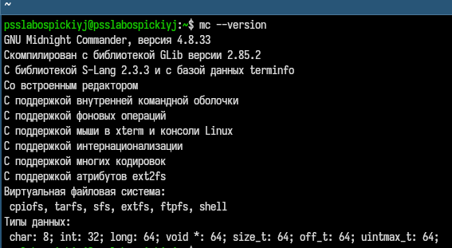
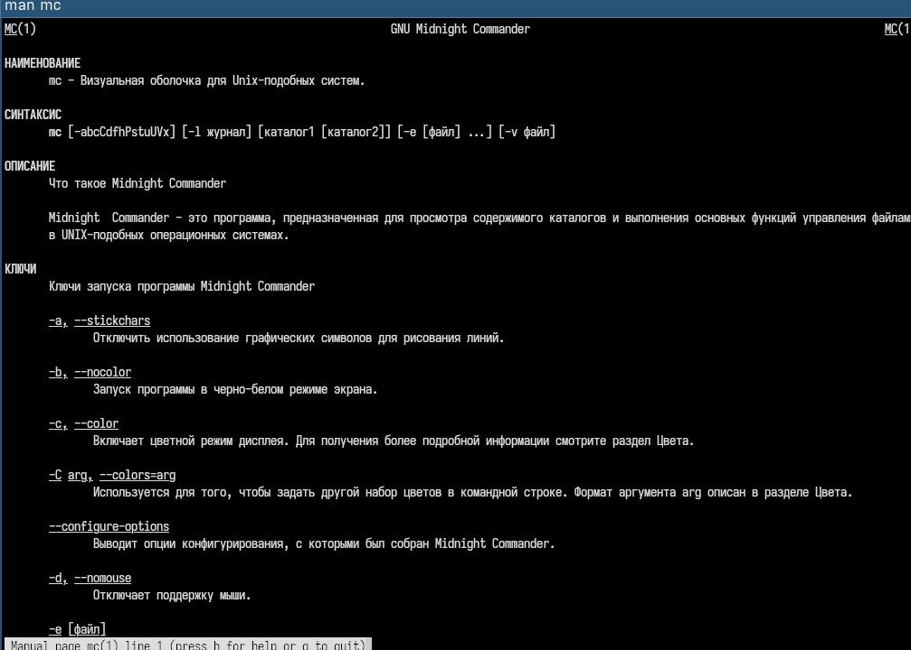
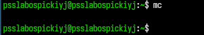

---
## Author
author:
  name: Слабоспицкий Платон Сергеевич
  degrees: DSc
  orcid: 0000-0002-0877-7063
  email: 1032253559@rudn.ru
  affiliation:
    - name: Российский университет дружбы народов
      country: Российская Федерация
      postal-code: 117198
      city: Москва
      address: ул. Миклухо-Маклая, д. 6

## Title
title: "Лабораторная работа №9"
subtitle: "дисциплина: Архитектура компьютеров"
license: "CC BY"
---

# Цель работы

Освоение основных возможностей командной оболочки Midnight Commander. Приобретение навыков практической работы по просмотру каталогов и файлов; манипуляций с ними.

# Задание

Изучить теоретический материал о Midnight Commander (mc): режимы панелей, меню, управляющие клавиши.

Выполнить основные операции с файлами и каталогами в mc (копирование, перемещение, создание, удаление, просмотр/редактирование текстовых файлов).

Использовать возможности встроенного редактора mc для редактирования текста (вставка, удаление, копирование, перемещение фрагментов, отмена действий, переход в начало/конец файла).

Освоить меню «Команда»: поиск файлов, история команд, быстрый переход в каталог.

Изучить меню «Настройки»: изменение внешнего вида и поведения mc.

# Теоретическое введение

Midnight Commander (mc) — псевдографическая командная оболочка для UNIX/Linux систем. После запуска (mc в командной строке) отображаются две панели со списками файлов. Управление осуществляется функциональными клавишами F1–F10 (помощь, меню, просмотр, редактирование, копирование, перемещение, создание каталога, удаление, выход) и комбинациями клавиш. Панели могут работать в режимах: «Стандартный», «Информация», «Дерево». Меню mc содержит пять разделов: «Левая панель», «Файл», «Команда», «Настройки», «Правая панель». Встроенный редактор позволяет выполнять базовые операции с текстом.

# Выполнение лабораторной работы
Запущена команда mc --version для определения установленной версии. Результат показан на скриншоте (версия 4.8.27, сборка с поддержкой subshell, редактора и др.).

С помощью команды man mc выведена полная справочная информация. На скриншоте видно описание ключей -V, -d, -c, а также разделы «Опции», «Конфигурация», «Клавиши». Изучена структура документации.

Выполнен запуск mc. На скриншоте отображено стандартное рабочее пространство: две панели с каталогами (левая — /home/username, правая — /home/username), меню вверху (Левая панель, Файл, Команда, Настройки, Правая панель), внизу — функциональные клавиши F1–F10 и командная строка.

4. Основные операции с файлами и каталогами в mc
4.1. Навигация и переключение панелей
Клавиша Tab использовалась для переключения активной панели.

Комбинация Ctrl+U поменяла панели местами.

Ctrl+O временно отключило панели, показав вывод командной оболочки (возврат — любая клавиша).

4.2. Работа с файлами
Выделение файлов: клавиша Insert для поштучного выделения, Ctrl+T — для выделения по шаблону (например, *.txt).

Копирование: выделен файл example.txt, нажата F5, указан каталог-назначение (~/backup/). Копирование выполнено.

Перемещение: выделен файл oldname.txt, нажата F6, введено новое имя/путь (~/newname.txt).

Просмотр информации: на активной панели через меню «Левая панель» → «Режим» выбран режим «Информация». Отобразились размер файла, права доступа, владелец, группа, время модификации, а также данные о файловой системе.

Изменение прав доступа: выбран файл, нажата Ctrl+X → C (или меню «Файл» → «Права»). Установлены права rw-r--r--.

5. Работа с текстовыми файлами через встроенный редактор
Создан текстовый файл text.txt (клавиша F7 для создания каталога, затем F4 для редактирования нового файла).

5.1. Редактирование
Вставлен фрагмент текста, скопированный из другого файла (выделение мышью или F3 для просмотра, затем F5 в редакторе).

Выполнены действия:

Указана строка текста.
Вырезан фрагмент (Ctrl+X), скопирован на новую строку (Ctrl+U в некоторых раскладках; в mc — F5 для копирования, F6 для перемещения).
Выделен фрагмент, перемещён на новую строку (F6).
Файл сохранён (F2).
Отменено последнее действие (Ctrl+Z или меню «Отменить»).
Переход в конец файла (Ctrl+End), добавлен текст.
Переход в начало файла (Ctrl+Home), добавлен текст.
Файл сохранён и закрыт (F10).
6. Использование меню «Команда»
Поиск файла: меню «Команда» → «Поиск файла». Задан шаблон *.cpp (или *.c), начальный каталог ~/. Найдены файлы main.cpp, utils.cpp.

История командной строки: «Команда» → «История командной строки». Отобразился список ранее введённых команд в оболочке.

Каталоги быстрого доступа: «Команда» → «Каталоги быстрого доступа» (Ctrl+\). Добавлен каталог /etc, выполнен быстрый переход в него.

Анализ файлов меню и расширений: открыты «Редактировать файл расширений» и «Редактировать файл меню» — изучен синтаксис ассоциаций программ с расширениями.

7. Настройка внешнего вида (меню «Настройки»)
Конфигурация: «Настройки» → «Конфигурация». Включена опция «Показывать скрытые файлы» (Show Hidden Files) — в панелях появились файлы .bashrc, .config.

Внешний вид: «Настройки» → «Внешний вид». Изменён режим на «Full Screen», затем «Double Width» — ширина панелей увеличилась.

Расцветка имён файлов: «Настройки» → «Расцветка имён файлов» — просмотрены правила выделения цветом для разных типов файлов.
# Выводы

В процессе выполнения лабораторной работы я освоил основные возможности командной оболочки Midnight Commander: навигацию по панелям, копирование, перемещение, удаление, создание каталогов и файлов, изменение прав доступа, использование встроенного редактора с операциями вырезания/копирования/вставки/отмены, поиск файлов по шаблону, работу с историей команд, быстрый переход в каталоги, а также настройку внешнего вида и поведения mc. Приобретённые навыки позволяют эффективно управлять файловой системой в псевдографическом режиме без необходимости использования графического интерфейса.

# Список литературы{.unnumbered}

::: {#refs}
:::
