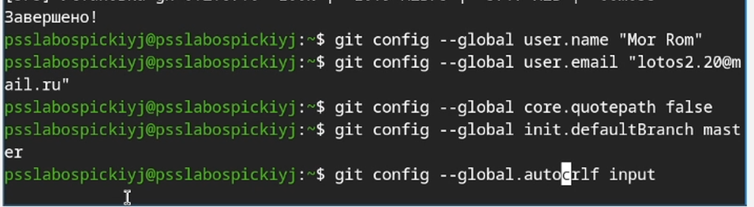

	#Лабороторная работа №3. Markdown
	##3.1 цель работы
Научиться оформлять отчеты с помощью легковесного языка разметки Markdown
## 3.2. Задание 
	-Сделать отчет по предыдущей лабороторной работе в формате Markdown.
	-Предоставить отчеты в 3 форматах: pdf, dock и md (в архиве, поскольку он должен содержать скрины, Makefile и т.д.).
## 3.3 Результаты выполнения задания
## 3.3.1 Настройка Git и создание SSH-ключа
Была произведена настройка глобальныз и локальных параметром Git: заданы имя пользователя, адрес электронной почты, отключено экранирование путей, установленна ветка по умолчанию 'master' и параметры окончаний строк.

	
Далее был сгенерирован SSH-ключ по алгоритму ed25519.

	
